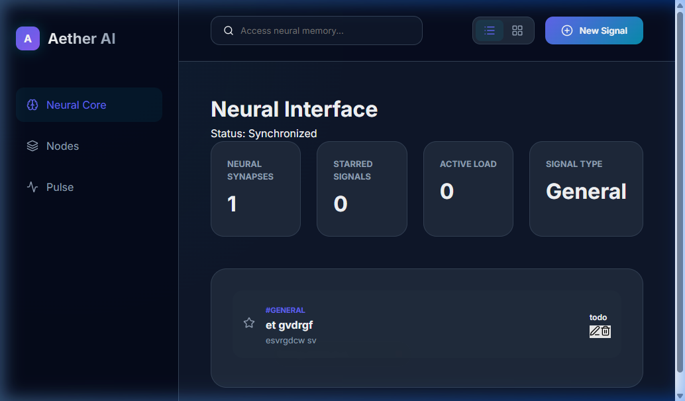

# 🌌 Aether AI | Neural Task Intelligence

Aether AI is a next-generation, premium task management system built with **Django REST Framework** and **React (Vite)**. It evolves the traditional CRUD application into a neural intelligence interface with dark-mode aesthetics, glassmorphism, and multi-view synchronization.



## 🚀 Key Features

- **Neural Stream (List View)**: Clean, high-density list for rapid signal management.
- **Neural Kanban (Board View)**: Visualize synaptic flow across status columns.
- **Neural Core & Nodes**: Intelligent sidebar navigation for filtering and category mapping.
- **Starred Pulse**: Focus on high-sensitivity/high-priority signals with one click.
- **Premium Design**: Cyber-aesthetic with glows, blurred layers, and smooth transitions.

## 🛠️ Technology Stack

- **Backend**: Python, Django, Django REST Framework
- **Frontend**: React (Vite), Axios, Lucide Icons, Vanilla CSS
- **Database**: SQLite (Default)
- **Version Control**: Git

## 🖥️ Local Setup

### 1. Prerequisites
Ensure you have **Python 3.14+** and **Node.js** installed.

### 2. Backend Initialization
```bash
# Run migrations
python manage.py makemigrations
python manage.py migrate

# Start the Neural Core
python manage.py runserver
```
The API serves at `http://127.0.0.1:8000/`.

### 3. Frontend Initialization
```bash
cd frontend
npm install

# Start the Neural Interface
npm run dev
```
The UI serves at `http://localhost:3000/`.

## 📌 Repository
Built and managed by **Janak Kandel**.
